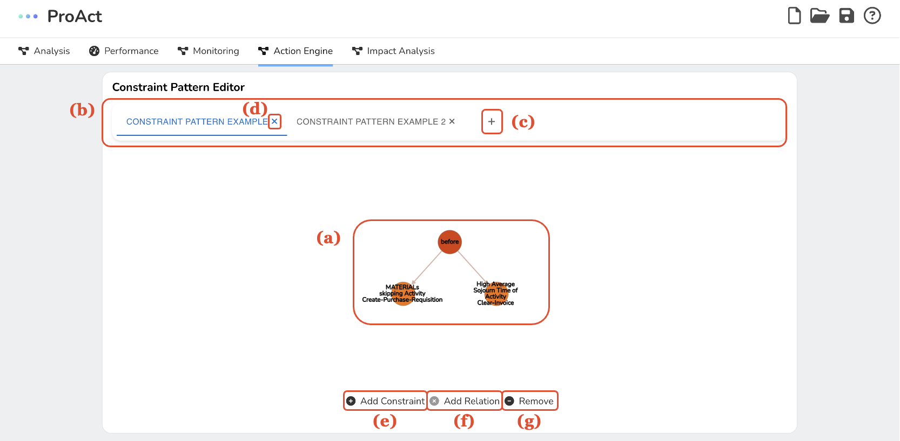
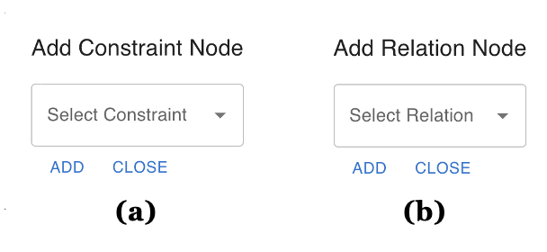
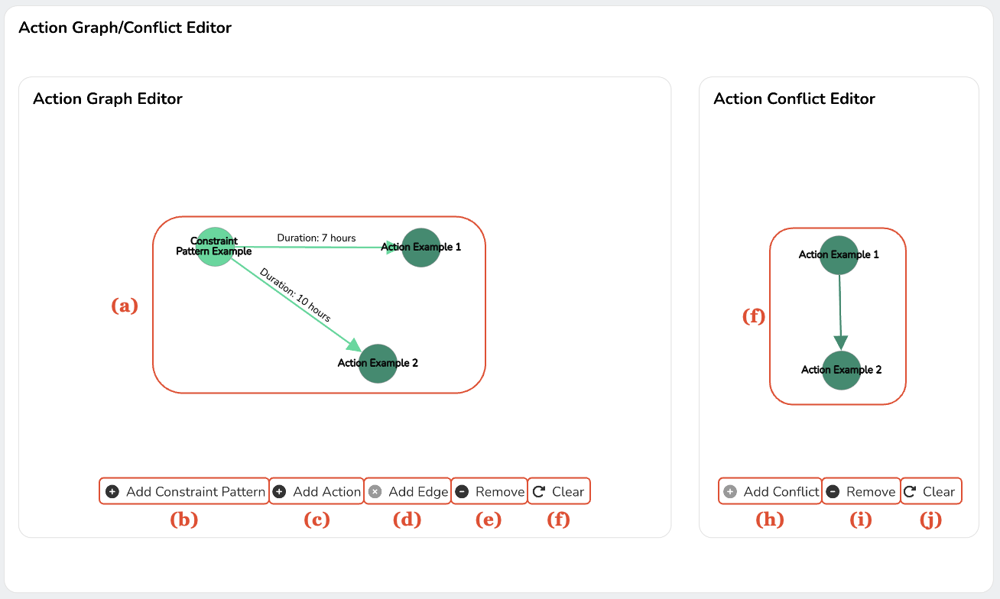
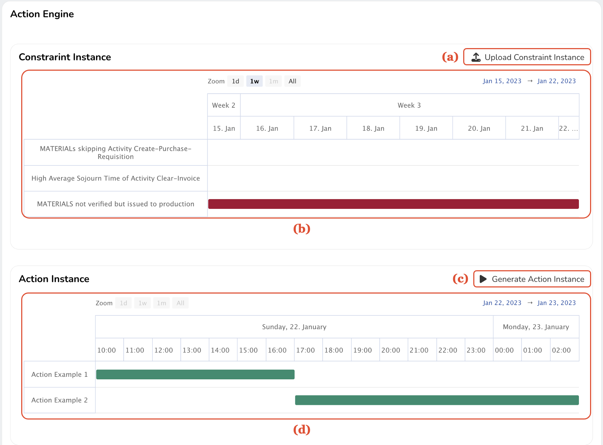

Action Engine enables you to manage operational constraints effectively. With a simple, intuitive interface, the app contains three main sections: the Constraint Pattern Editor, Action Graph Editor, and Action Engine & Visualization.

## Constraint Pattern Editor
This tool allows you to create, adjust, and maintain constraint pattern trees with ease. A pattern tree comprises nodes (which symbolize operational constraints) and edges (depicting temporal relations between these constraints).

*A screenshot of the constraint pattern editor: (a) a constraint pattern tree, (b) tabs displaying constraint pattern trees, (c) adding a constraint pattern tree, (d) deleting a constraint pattern tree, (e) a button to add operational constraints, (f) a button to add temporal relations, and (g) a button to remove elements.*

In the above image, you can see a constraint pattern tree. Light orange nodes denote operational constraints, while dark orange nodes indicate temporal relations. Simply select nodes and edges to either establish new temporal relations or delete existing ones.

The tool interface includes a set of tabs representing existing constraint pattern trees. You can easily switch between trees by clicking on these tabs. To create a new pattern tree, click on the "+" tab. Each tab also has an icon for deleting the associated constraint pattern tree.

Want to add a new constraint node to the graph? Click on the "Add Constraint" button and select the desired constraint from the available list.

The "Add Relation" button lets you create a new edge between two selected nodes - all you need to do is choose a temporal relation type. Please note, this button will only activate when exactly two nodes are selected.

Need to remove nodes or edges from your graph? Simply use the "Remove" button to do so.

{: style="width:400px;"}

*Dialogs in the constraint pattern editor: (a) a dialog to select an operational constraint to add and (b) a dialog to select a temporal relation to add.*

## Action Graph and Conflict Editor
This tool is specifically designed to assist you in creating and editing action graphs and conflicts.

*A screenshot of the action graph/conflict editor: (a) an action graph, (b) a button to add constraint pattern trees, (c) a button to add actions, (d) a button to add an edge connecting constraint pattern trees to actions, (e) a button to remove elements in the action graph, (f) a button to clear the action graph, (g) a conflict graph, (h) a button to add action conflicts, (i) a button to remove action conflicts, and (j) a button to clear all the action conflicts.*

The image above displays an action graph with nodes symbolizing constraint pattern trees or actions, and edges linking pattern trees to actions.

Add a constraint pattern node to your action graph using the "Add Constraint Pattern" button. To add an action node, click on the "Add Action" button.

You can add an edge between the selected constraint pattern tree and action using the "Add Edge" button. To remove any nodes or edges from your action graph, use the "Remove" button. If you want to start from scratch and remove all nodes and edges from your action graph, click on the "Clear" button.

The Action Conflict Editor helps you create and manage conflicts between actions. This interface comprises nodes and edges, symbolizing actions and conflicts, respectively. You can add a conflict between two selected action nodes using the "Add Conflict" button (this will only activate when exactly two nodes are selected). To delete selected conflicts from your action conflict graph, use the "Remove" button. Clear all conflicts from the action conflict graph using the "Clear" button.

## Action Engine
This is where you can analyze constraint instances, generate action instances based on the action graph and action conflict, and visualize the results in a clear, user-friendly manner.

*A screenshot of the action engine: (a) a button to upload constraint instances, (b) a visualization of constraint instances, (c) a button to produce action instances, and (d) a visualization of action instances.*

Start by uploading constraint instances in JSON format (which includes the constraint name, start, and end times). Click on the "Upload Constraint Instance" button to open a file selection dialog. Once uploaded, you'll be able to see the constraint instance in the Constraint Instance panel.

After uploading the constraint instance, generate action instances by clicking on the "Generate Action Instance" button. This initiates the computational process, which examines the constraint instance based on the action graph and action conflict you've created.

Upon completion of the computation, you'll see the generated action instances in the Action Instance panel. Each action instance is represented as a horizontal bar over time, with the position and length of the bar indicating the start and end times of the action instances, respectively.
