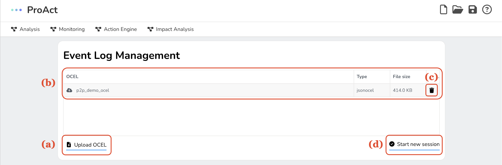
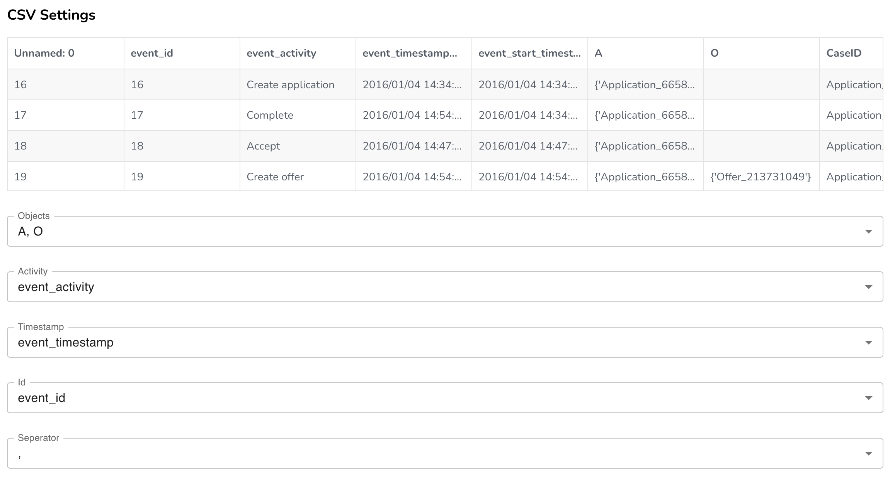

Event Log Management is designed to simplify your interaction with Object-Centric Event Logs (OCELs). Through a user-friendly interface, you can upload, select, delete, and preview your OCELs.

Upon launching the tool, you will land on the event log management page. It's your one-stop-shop for viewing available OCELs, removing existing ones, uploading new logs, starting new constraint monitoring sessions, and even previewing your uploaded CSV files.

*A screenshot of the event log management page*

To add a new OCEL, click the Upload OCEL button and select the file in either CSV or JSONOCEL format. Once uploaded, the file will join the list of available OCELs.

If you need to remove an OCEL, you can easily do so by clicking the bin icon next to the log's name. Keep in mind, deleting an OCEL will also erase all associated data, including cached analysis results. If you re-upload the OCEL, the analysis will need to be conducted again.

To start a new monitoring session, select an OCEL and click the Start new session button. The tool will remember your choice and use this OCEL as the default in future sessions, loading all associated metrics.

*A screenshot of configuring settings of importing CSV OCELs*

For CSV OCELs, you have the option to preview the file and adjust various settings once you've selected the OCEL from your list. The tool tries to estimate which columns correspond to specific fields, but this might not always be accurate. Therefore, make sure to verify the selected fields and adjust them as necessary.
