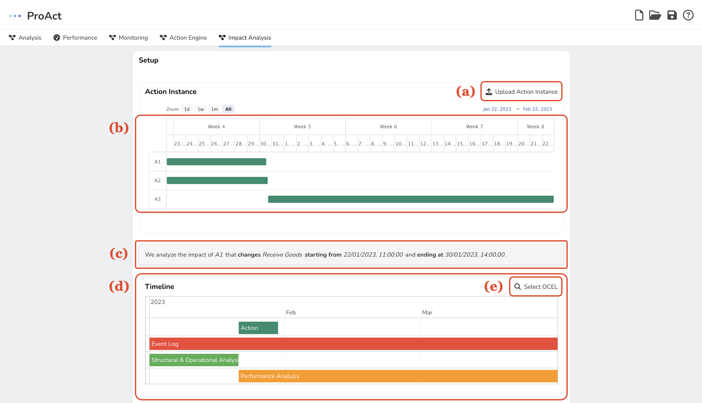
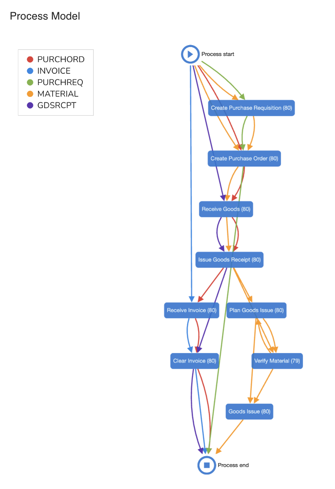
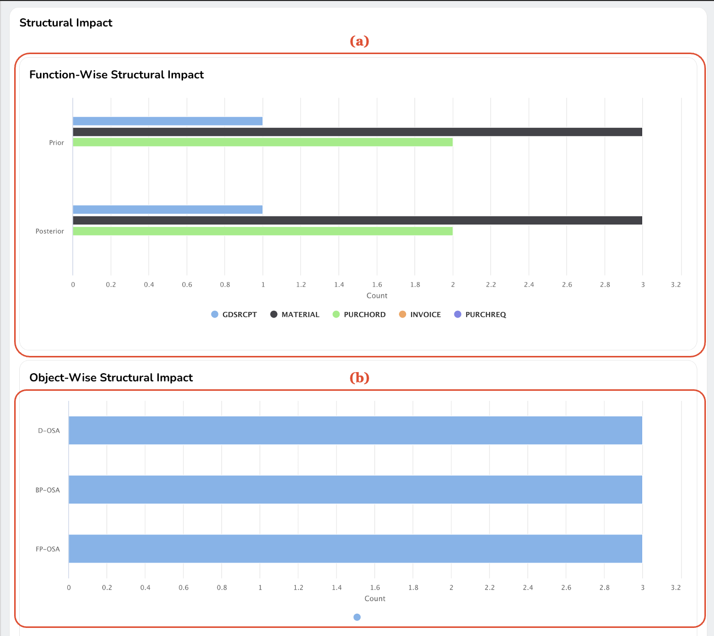
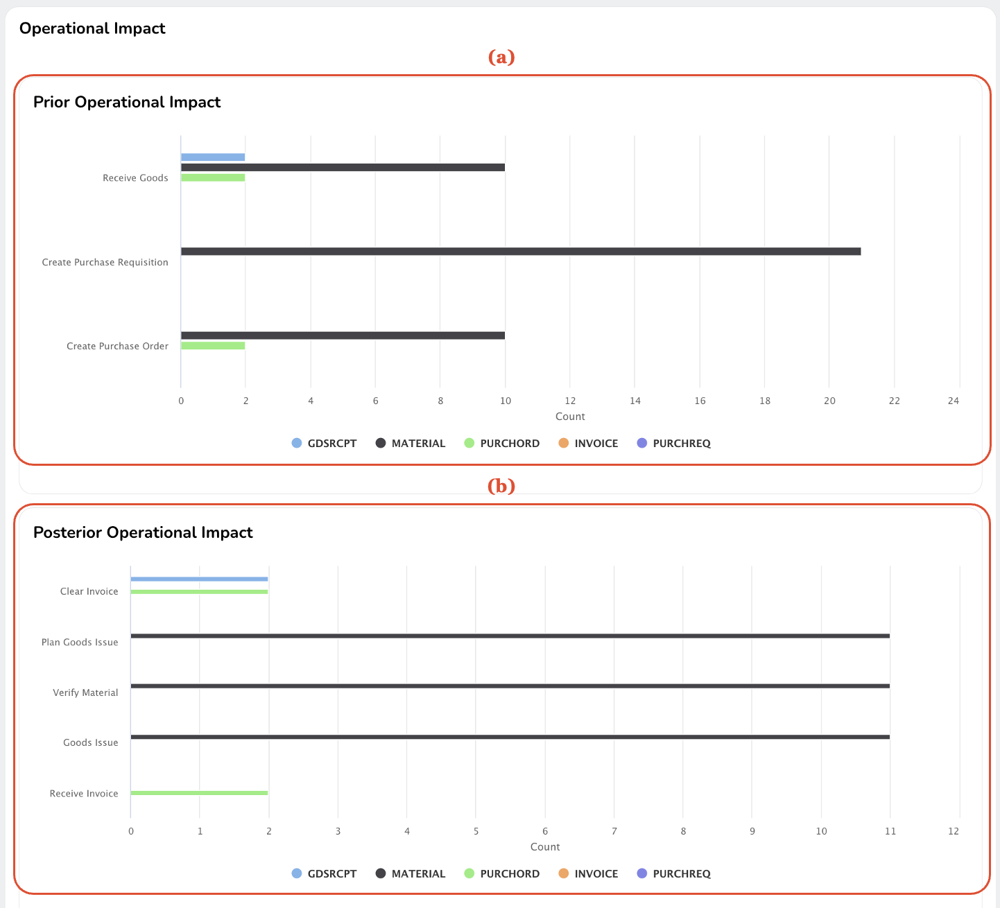
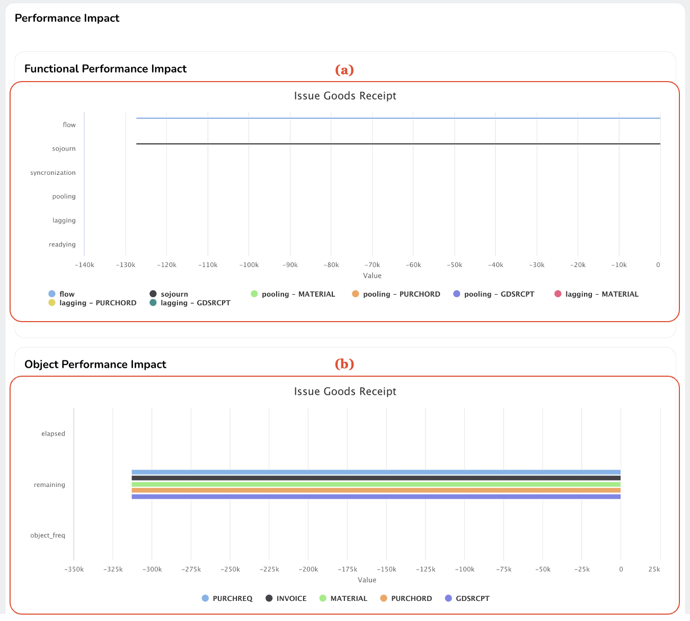

Impact Analysis is designed to help you conduct robust impact analysis. The tool encompasses four main components: Impact Analysis Setup, Structural Impact Analysis, Operational Impact Analysis, and Performance Impact Analysis. This guide will walk you through each component and its usage.

## Setting up Impact Analysis
Before you start, it's crucial to set up the impact analysis correctly. Begin by uploading action instances in JSON format files containing action names and their respective start and end timestamps.

*A screenshot of the impact analysis setup: (a) a button to upload action instances, (b) an action instance chart, (c) a message describing the action instance to analyze, (d) a timeline showing the overview of the planned impact analysis, and (e) a button to select object-centric event logs to use for the impact analysis.*

After uploading the action instances, they'll be visualized on a Gantt chart (Fig b), offering an overview of action instances and their respective durations. Click on a cell in the action instance chart to select a specific action instance, which will open a dialog for you to select the activity affected by the action.

Your selected action instance and modified activity will be displayed as in Fig c. The timeline panel (Fig d) will provide a chronological overview of the planned impact analysis. Your action cell in the timeline panel is automatically updated when you choose an action instance from the chart.

Now, select object-centric event data for impact analysis by clicking the button shown in Fig e. The application will automatically determine the portions of event data used for structural and operational impact analysis and performance impact analysis, based on the action instance's timing and the event data's duration. You can adjust the performance analysis period by dragging and moving the cell.

{: style="width:400px;"}

*A dialog to select the activity that is influenced by the selected action instance*

## Structural Impact Analysis
This tool allows you to assess the structural impacts of your chosen action instance interactively.

*A screenshot of the structural impact analysis: (a) an interactive bar chart showing the function-wise structural impact and (b) an interactive bar chart showing the object-wise structural impact.*

The component comprises two main sections: Function-wise Structural Impact Analysis (FSA - Fig a) and Object-wise Structural Analysis (OSA - Fig b).

In FSA charts, the horizontal axis signifies categories of analysis (prior FSA and posterior FSA), while the vertical axis represents the number of impacted activities. Each bar in the chart is color-coded for different object types, enabling you to compare the action instance's impact on various object types before and after the changed activity.

OSA charts depict the impact of the selected action instance on object types. The vertical axis represents the number of affected object types. These charts help you understand the action instance's influence on different object types directly associated with the changed activity and those processed by activities preceding and following the changed activity.

## Operational Impact Analysis
The Operational Impact Analysis component lets you examine the operational impact of the selected action instance.

*A screenshot of the operational impact analysis: (a) an interactive bar chart showing the prior operational impact and (b) an interactive bar chart showing the posterior operational impact.*

The component includes two sections: Prior Operational Impact Analysis (Prior OIA - Fig a) and Posterior Operational Impact Analysis (Posterior OIA - Fig b).

In Prior OIA charts, the horizontal axis represents activities, while the vertical axis shows the number of affected objects for the activities. Each bar in the chart is color-coded to denote different object types, allowing you to investigate the action instance's impact on various object types processed after specific activities and before the changed activity. The Posterior OIA chart follows the same format to visualize the posterior object impact of the selected action instance.

## Performance Impact Analysis
This component enables you to evaluate the performance implications of an action instance within the process model.

*A screenshot of the operational impact analysis: (a) an interactive bar chart showing the prior operational impact and (b) an interactive bar chart showing the posterior operational impact.*

The component includes Function-wise Performance Impact Analysis (FPA - Fig a) and Object-wise Performance Impact Analysis (OPA - Fig b).

The FPA chart displays different function-wise performance measures (flow time, sojourn time, synchronization time, pooling time, lagging time, and readying time) on the horizontal axis and the numerical value of the performance impact for each functional aspect on the vertical axis. Each bar is color-coded to signify different object types and the combination of performance measures with process types.

The OPA chart displays different object-wise performance measures (elapsed time, remaining time, and object frequency) on the horizontal axis and the numerical value of the performance impact for each object type on the vertical axis. Each bar is color-coded to indicate different object types.
