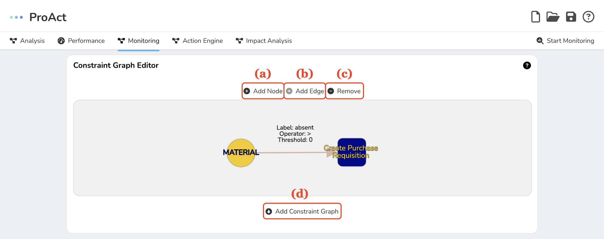
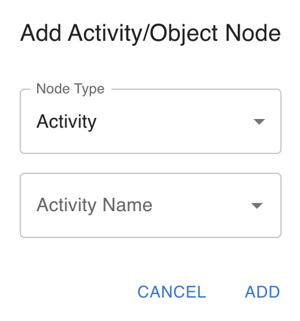
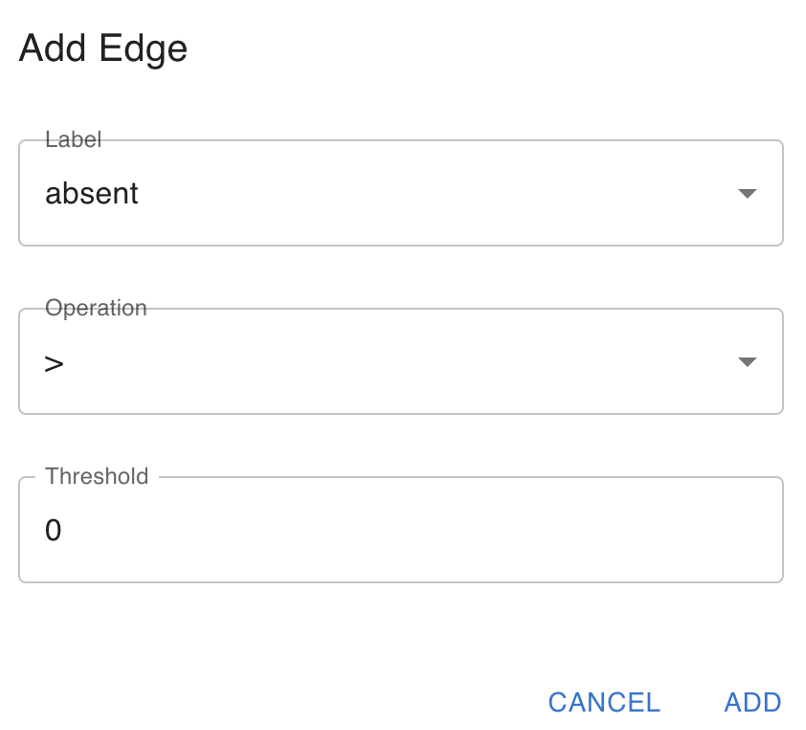
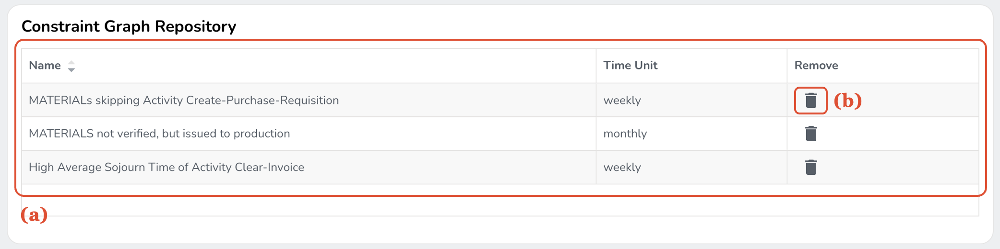
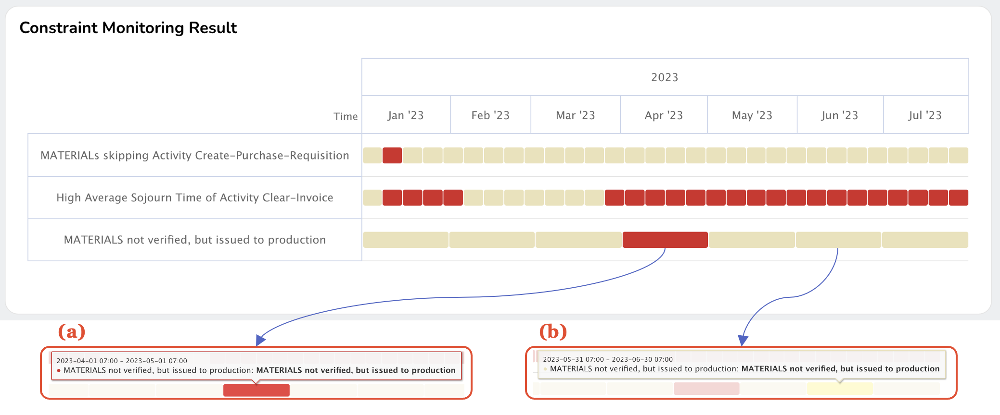

Monitoring Engine facilitates the design of object-centric constraint graphs, storage of these graphs, monitoring of the operational constraints, and visualizing monitoring results. It includes three sub-components that work together to deliver these functionalities: the constraint graph editor, constraint graph repository, and monitoring and visualization.

*A screenshot of the process analysis page's constraint graph editor: (a) Adding nodes, (b) Adding edges, (c) Removing elements, and (d) Adding constraint graphs*

## Constraint Graphical Editor
The constraint graphical editor is a versatile, interactive tool that lets you create and edit Object-Centric Constraint Graphs (OCCGs). You can add or remove nodes and edges, specify properties of these elements, and store the resulting constraint graph in a database.

Nodes, representing activities or objects, can be added by clicking the Add Node button, which opens a dialog to choose the node type (Activity or Object) and its name.

{: style="width:200px;"}
<!-- <figure markdown>
  { width="200" }
</figure> -->
*A screenshot of dialog to specify the properties of nodes to be added*

Edges between nodes can be added through the Add Edge button. This opens another dialog where you can define the edge label, operation, and threshold. This button is enabled only when certain conditions are met, such as selecting a single activity node (for adding an AA edge), an object node, and an activity node (for adding an OA edge), or two activity nodes and one object node in the specified order (for adding an AOA edge).

{: style="width:300px;"}

*A screenshot of dialog to specify the properties of edges to be added*

The Remove button allows you to delete selected nodes and edges from the constraint graph. Lastly, the Add Constraint Graph button lets you save the constraint graph in the database, after assigning a unique name to the graph and selecting the appropriate time unit.

## Constraint Graph Repository
The constraint graph repository serves as a storage and access point for managing constraint graphs added from the editor. Here, you can view, filter, and delete existing graphs as per your needs.

*A screenshot of constraint graph repository*

The information about constraint graphs is presented in a tabular format, detailing the unique name assigned to each graph, the time unit associated with it, and an action button to delete a specific graph from the repository.

## Monitoring and Visualization
The monitoring and visualization component enables the analysis of the constraint graphs existing in the repository by examining the uploaded event log and then visualizing the monitoring results using a Gantt-chart-like representation. This visualization allows you to track and assess the occurrences of constraint graphs in the context of the input event log, offering valuable insights into the temporal relationships of the constraints.

*A screenshot of visualizing monitoring results*

In the visualization, the Y-axis of the chart represents constraint graphs, and the X-axis denotes time. Each cell signifies the occurrence or non-occurrence of the corresponding constraint graph; a red cell indicates the occurrence of the constraint during the depicted time period, whereas a yellow cell signifies non-occurrence. For instance, the red cell represents the occurrence of the MATERIAL not verified, but issued to production constraint during a specified time period. Conversely, the yellow cell represents the non-occurrence of the constraint during a different period.
