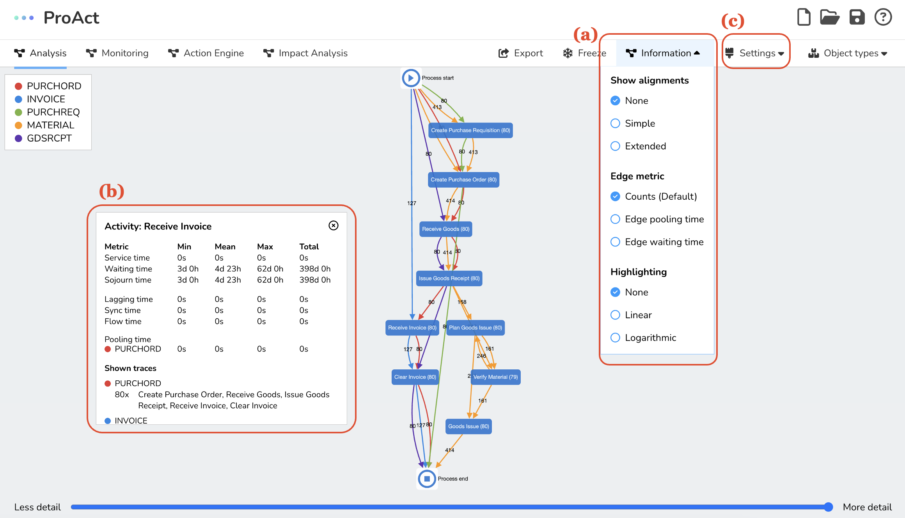

The Process Analysis is where you can dive deep into your uploaded event logs. This component is all about supporting you in the identification of operational constraints that need monitoring. By interacting with and visualizing Directly Follows Multigraphs (DFMs), you can focus on the crucial aspects of your process and discern the operational constraints to keep an eye on.

*A screenshot of the process analysis page: (a) A DFM discovered from an uploaded OCEL, (b) Multiple edges representing the involvement of multiple objec types, (c) Freezing the layout of the DFM*

Above you can see the process analysis page. The DFM discovered from your uploaded OCEL is shown as a colorful interconnected web, where each node represents an activity from the event log, and edges depict the directly-follows relation between activities. Multiple edges between two nodes highlight the involvement of multiple object types in those activities, with different colors representing each type. For instance, the yellow edge denotes the involvement of MATERIAL and the green edge signifies PURCHREQ in Create Purchase Requisition and Create Purchase Order activities. The graph can be zoomed, panned, and nodes repositioned for optimal visualization. There's also a freeze mode to disable layout recalculations and keep the graph layout static.

*A screenshot of the process analysis page: (a) the selection of the information to be displayed, (b) performance metrics and trace data for the selected element, (c) the selection of visualization settings*

With the information dropdown in the navigation bar, you can customize the graph display to include additional details like edge labels and highlighting modes. Edge labels can provide information like the number of objects traversing an edge or various time-related metrics. Highlighting modes adjust edge widths based on the selected criteria, offering both linear and logarithmic scales for specific metrics.

By clicking on nodes and edges, you can pull up an information box containing performance metrics and trace data for the chosen element. These metrics include flow, sojourn, synchronization, pooling, lagging, and readiness time. If you want to disable this information box, you can do so in the settings menu.

*A screenshot of the process analysis page: (a) the threshold slider to filter frequent behavior and (b) the selection of object types*

OCELs often contain a blend of typical process behavior and outlier cases, which can complicate the model. To keep things simple, you can use the threshold slider at the bottom of the page to filter and display only the most frequent behavior. This threshold represents the proportion of objects shown in the model, making it easier to identify the operational constraints to be monitored. Furthermore, if you're only interested in specific object types, you can filter the graph by selecting your object types of interest through the "Object Types" button in the top right corner.
